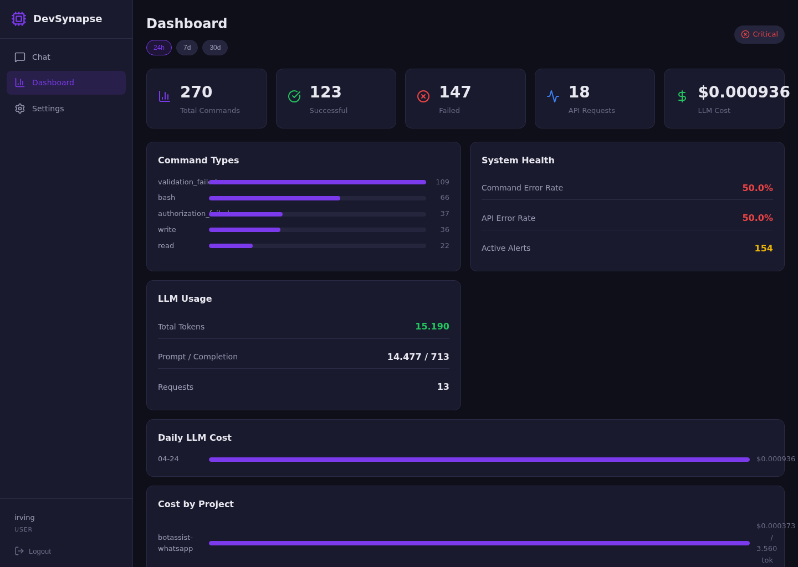
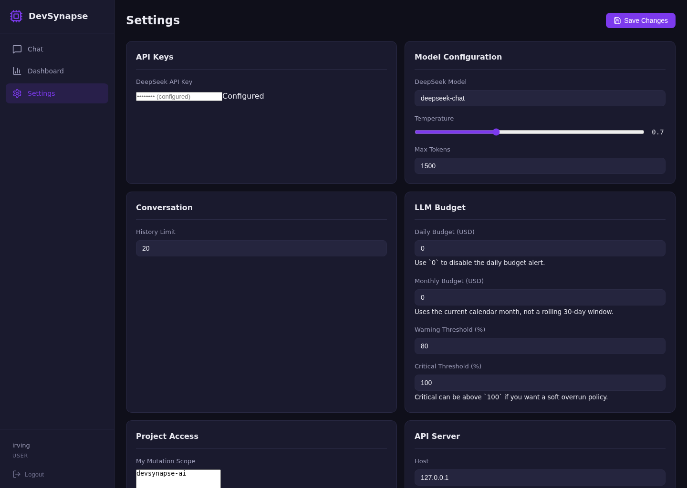
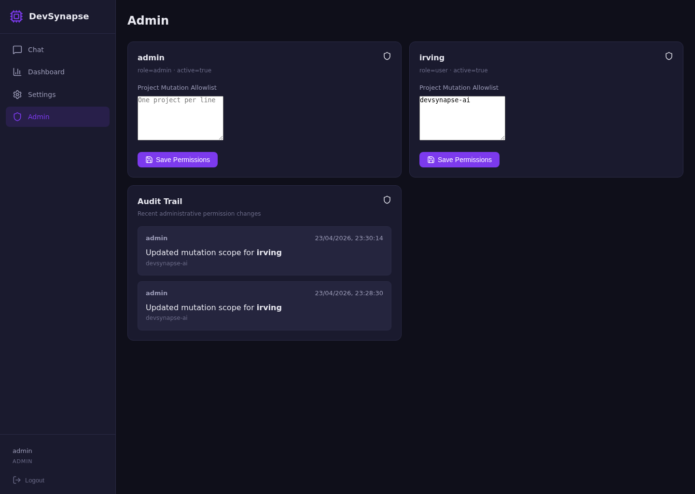

# DevSynapse AI

[](https://github.com/N1ghthill/devsynapse-ai/actions/workflows/ci.yml)
[](LICENSE)


DevSynapse AI is an open source development assistant that combines:
- DeepSeek-first LLM access through a user-provided API key;
- real-time streaming chat with token-by-token delivery (SSE);
- project-aware technical chat with a project selector in the UI;
- persistent memory for conversations, preferences and projects;
- controlled command execution with explicit authorization boundaries and per-project working directories;
- operational visibility through monitoring, usage tracking, budget thresholds (enabled by default) and alerts.
- portable configuration via environment variables with sensible auto-detection.

The repository is organized for contributors, not only for local use. Backend contracts, frontend behavior, persistence and runtime workflows are documented and versioned in-repo.

## Why It Exists

DeepSeek is strong for development work, but it does not ship with a dedicated coding-agent environment. DevSynapse AI is that missing layer: a local-first browser workspace around a DeepSeek API key, with persistent memory, controlled command execution, project-scoped authorization and cost visibility.

## Use Cases

- **Budget-conscious developer:** use DeepSeek through your own API key, keep conversations local, track token/cost usage and set daily or monthly budget thresholds.
- **Freelancer with multiple clients:** keep project context explicit, scope mutating commands per project and report usage/cost by project.
- **Contributor or maintainer:** inspect chat history, command outcomes, monitoring data, budget alerts, permissions and audit records from one local UI.

## Product Showcase

| Controlled coding workflow | Cost and project telemetry |
| --- | --- |
|  |  |

| DeepSeek and budget settings | Project permission administration |
| --- | --- |
|  |  |

More context is available in the [product showcase](docs/product/showcase.md) and the [screenshot evidence index](docs/screenshots/README.md).

## License

This project is licensed under the MIT License. See [LICENSE](LICENSE).

## Verified Baseline

Documentation refresh validated on `2026-04-24` (v0.3.0):
- backend test suite: `116 passed`
- frontend production build: passed
- local API + frontend integration validated manually during development
- public onboarding flow revalidated from a clean clone with fresh dependency installs, migrations, seeded users, route-level test pass and frontend build
- LLM usage telemetry, streaming chat delivery, project selector, conversation persistence, execution workflow and dashboard metrics are active in the current codebase

## What The Project Does

DevSynapse AI provides:
- a FastAPI backend for auth, chat, streaming chat (SSE), command execution, monitoring, settings and admin flows;
- a React/Vite frontend with chat, project selector, dashboard, settings and admin interfaces;
- SQLite-backed persistence for runtime state and migration-controlled schema evolution;
- a DeepSeek API orchestration layer with streaming token delivery, command extraction and degraded responses;
- a constrained execution bridge for `bash`, `read`, `glob`, `grep`, `edit` and `write` with per-project working directories;
- per-user, project-scoped mutation authorization for non-admin users;
- token and cost telemetry for LLM usage;
- configurable daily/monthly LLM budgets with warning and critical thresholds, enabled by default.

## Repository Map

```text
devsynapse-ai/
├── api/                    # FastAPI application, contracts and routes
├── config/                 # Centralized settings and policy constants
├── core/                   # Brain, auth, memory, monitoring, bridge, plugins
├── docs/                   # Contributor-facing technical documentation
├── frontend/               # React/Vite operator UI
├── plugins/                # Plugin implementations
├── scripts/                # Local operational utilities
├── tests/                  # Unit and integration tests
├── data/                   # SQLite databases (generated locally)
├── logs/                   # Runtime logs (generated locally)
├── .env.example            # Runtime configuration template
├── Makefile                # Common dev commands
└── README_PROFESSIONAL.md  # Engineering-oriented companion doc
```

## Quick Start

Before you start, see the contributor-focused setup path in [docs/development/onboarding.md](docs/development/onboarding.md).

### Easy Path

```bash
python3 -m venv venv
source venv/bin/activate
make setup
```

Add your DeepSeek key to `.env`:

```env
DEEPSEEK_API_KEY=your-key-here
```

Then run the whole local app:

```bash
make dev
```

### Manual Backend

```bash
make run
```

### Manual Frontend

```bash
cd frontend && npm run dev
```

### Local URLs

- frontend: `http://127.0.0.1:5173`
- OpenAPI docs: `http://127.0.0.1:8000/docs`
- health endpoint: `http://127.0.0.1:8000/health`

### Screenshots

Curated product screenshots are available in [docs/screenshots/README.md](docs/screenshots/README.md).
Use-case context is documented in [docs/product/showcase.md](docs/product/showcase.md).

## Main Development Commands

```bash
make setup
make dev
make test
make lint
make frontend-build
make verify
make migrate
make migration-status
```

## Documentation Index

Start here:
- contributor guide: [CONTRIBUTING.md](CONTRIBUTING.md)
- agent/contributor operating guide: [AGENTS.md](AGENTS.md)
- product positioning analysis: [DevSynapse_IA.md](DevSynapse_IA.md)
- code of conduct: [CODE_OF_CONDUCT.md](CODE_OF_CONDUCT.md)
- security policy: [SECURITY.md](SECURITY.md)
- changelog: [CHANGELOG.md](CHANGELOG.md)
- documentation index: [docs/README.md](docs/README.md)

Technical guides:
- product showcase: [docs/product/showcase.md](docs/product/showcase.md)
- contributor onboarding: [docs/development/onboarding.md](docs/development/onboarding.md)
- architecture overview: [docs/architecture/overview.md](docs/architecture/overview.md)
- persistence and data model: [docs/architecture/data-model.md](docs/architecture/data-model.md)
- API overview: [docs/api/overview.md](docs/api/overview.md)
- development workflow: [docs/development/workflow.md](docs/development/workflow.md)
- testing guide: [docs/development/testing.md](docs/development/testing.md)
- development roadmap: [docs/development/roadmap.md](docs/development/roadmap.md)
- runtime and delivery notes: [docs/deployment/runtime.md](docs/deployment/runtime.md)

Supplementary references:
- engineering guide: [README_PROFESSIONAL.md](README_PROFESSIONAL.md)
- frontend guide: [frontend/README.md](frontend/README.md)

## Roadmap

The canonical planning source is [docs/development/roadmap.md](docs/development/roadmap.md).
It separates completed baseline capabilities from current priorities, later work and explicitly deferred production-hardening scope.

## Contribution Scope

Contributions are welcome for:
- bug fixes and reliability improvements
- documentation quality and contributor ergonomics
- monitoring, telemetry and operational maturity
- frontend UX improvements that preserve current backend contracts
- security hardening and test coverage expansion

Before opening a PR, read [CONTRIBUTING.md](CONTRIBUTING.md).
For the shortest setup path from a new clone, read [docs/development/onboarding.md](docs/development/onboarding.md).

## Security Boundary

This project executes constrained development-oriented commands, but it is not a full sandbox product. The repository should be described as a safer local execution framework, not as a formally hardened isolation system. See [SECURITY.md](SECURITY.md).
