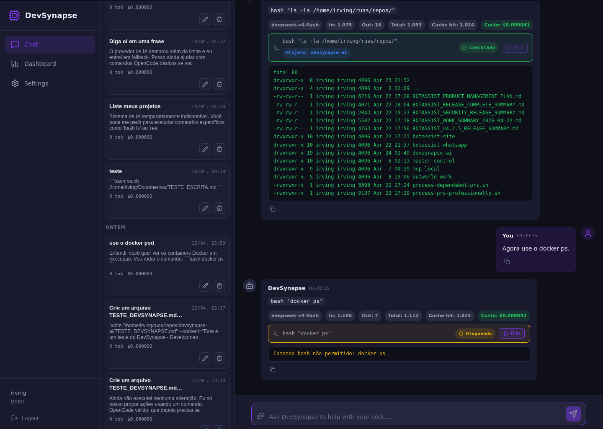

# Product Showcase

DevSynapse AI is a DeepSeek-first coding workspace. The product thesis is narrow on purpose: DeepSeek is robust for development work, but developers still need a practical environment around it for project context, safe command execution, persistence, cost controls and operational visibility.

This page maps the current product surface to concrete use cases and evidence captured from the local app.

## Current Evidence

Baseline validated on `2026-04-25`:
- `make verify` passed with backend tests, script checks, frontend lint and frontend build
- GitHub Actions CI passed on `main`
- installer/updater/uninstaller smoke tests passed
- portable configuration via environment variables verified

Screenshot sources:
- [screenshot evidence index](../screenshots/README.md)
- [testing guide](../development/testing.md)
- [release notes](../releases/v0.3.4.md)

## Use Cases

### Budget-conscious developer

This user wants strong coding help without a subscription-style IDE assistant.

Current support:
- DeepSeek API key configuration
- model, temperature and token settings
- persisted chat history with streaming real-time responses
- LLM token and estimated cost tracking
- daily and monthly budget thresholds (enabled by default)
- dashboard visibility for usage and alerts
- portable workspace configuration via environment variables
- non-interactive installed update flow with runtime backup

### Freelancer with multiple projects

This user needs to work across client repositories without mixing context or write permissions.

Current support:
- explicit project context on chat and execution flows
- project selector in the chat UI
- project-scoped mutation authorization for non-admin users
- working directory resolution per project for bash/grep commands
- command execution telemetry by project
- admin project registration and project permission management
- audit records for administrative permission and project registration changes

### Local coding operator

This user wants one browser UI for chat, commands, monitoring and configuration.

Current support:
- authenticated operator UI
- chat with real-time streaming responses
- command proposals with execution confirmation
- controlled execution for `bash`, `read`, `glob`, `grep`, `edit` and `write`
- explicit command status for success, blocked and failed states
- monitoring dashboard for command/API activity
- keyboard shortcuts: Enter / Ctrl+Enter to send, Shift+Enter for newline

Relevant screenshot:

## What The Screenshots Prove

- The UI is integrated with the authenticated backend.
- Command execution is visible to the user instead of hidden behind chat text.
- Blocked commands and failed/unsafe actions have explicit status.
- LLM usage and cost telemetry are part of the operator workflow.
- DeepSeek settings, budget controls and project mutation scope are exposed in the product UI.
- Admin users can inspect and manage project mutation permissions.

## What This Does Not Claim

DevSynapse AI should not be marketed as:
- a local quantized model runner;
- a provider-neutral model router;
- a full sandbox isolation product;
- enterprise RBAC;
- a production-complete multi-tenant platform.

The current claim is stronger because it is narrower: DevSynapse AI is a local-first DeepSeek coding environment with persistence, controlled execution, project-aware authorization and cost visibility.
