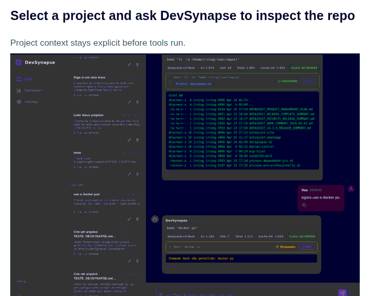
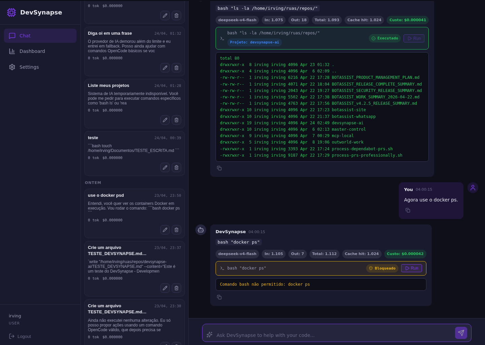

# Product Showcase

DevSynapse AI is a DeepSeek-first coding workspace. The product thesis is narrow
on purpose: DeepSeek is robust for development work, but developers still need a
practical environment around it for project context, safe command execution,
persistence, cost controls and operational visibility.

The current MVP position is:

> AI coding assistant for Linux developers who want DeepSeek without losing local control.

The demo GIF is assembled from current product screenshots to communicate the
core loop quickly: project context, command review, confirmed execution,
assistant interpretation and cost visibility. A live recording should replace it
when a release demo video is captured.

This page maps the current product surface to concrete use cases and evidence captured from the local app.

## Current Evidence

Repository baseline validated on `2026-05-01`:
- `make verify` passed with `225` backend tests, script checks, frontend lint and frontend build
- `make desktop-build` verified the desktop packaging flow
- `make ui-smoke` verified login, project management, dashboard, settings and admin navigation
- GitHub Actions CI passed on `main`
- portable runtime configuration via environment variables verified

Real DeepSeek agent evidence captured on `2026-05-02`:
- DevSynapse ran against a disposable project, not a real user repository
- the agent inspected code, diagnosed failing tests, edited the bug and re-ran validation
- final result: `3 passed in 0.01s`
- token, cache-hit and cost telemetry were recorded in the chat UI

See the [evaluation evidence index](../evaluation/README.md) and the
[real DeepSeek run](../evaluation/real-llm/2026-05-02-real-deepseek-evidence.md).
Fresh local evidence can be generated with `make eval-agent`; the repeatable
benchmark scenarios are documented in
[reproducible benchmarks](../evaluation/reproducible-benchmarks.md).

Screenshot sources:
- [screenshot evidence index](../screenshots/README.md)
- [evaluation screenshots](../evaluation/README.md)
- [testing guide](../development/testing.md)
- [release notes](../releases/v0.6.3.md)

## Use Cases

### Budget-conscious developer

This user wants strong coding help without a subscription-style IDE assistant.

Current support:
- DeepSeek API key configuration
- model, temperature and token settings
- persisted chat history with streaming real-time responses
- LLM token and estimated cost tracking
- daily and monthly budget thresholds (enabled by default)
- dashboard visibility for usage and alerts
- portable workspace configuration via environment variables
- non-interactive installed update flow with runtime backup

### Freelancer with multiple projects

This user needs to work across client repositories without mixing context or write permissions.

Current support:
- explicit project context on chat and execution flows
- project selector in the chat UI
- project chips in conversation history and chat messages
- saved conversations restore their persisted project scope when reopened
- project-scoped mutation authorization for non-admin users
- working directory resolution per project for bash/grep commands
- command execution telemetry by project
- admin project registration and project permission management
- audit records for administrative permission and project registration changes

### Local coding operator

This user wants one browser UI for chat, commands, monitoring and configuration.

Current support:
- authenticated operator UI
- chat with real-time streaming responses
- command proposals with execution confirmation
- command confirmation details for risk, directory and expected effect before execution
- controlled execution for `bash`, `read`, `glob`, `grep`, `edit` and `write`
- explicit command status for success, blocked and failed states
- workflow templates for test runs, failing-test analysis, TODO search, repository summaries, changelog drafts and Docker inspection
- monitoring dashboard for command/API activity
- keyboard shortcuts: Enter / Ctrl+Enter to send, Shift+Enter for newline

Relevant screenshot:

## What The Screenshots Prove

- The UI is integrated with the authenticated backend.
- Command execution is visible to the user instead of hidden behind chat text.
- Blocked commands and failed/unsafe actions have explicit status.
- LLM usage and cost telemetry are part of the operator workflow.
- DeepSeek settings, budget controls and project mutation scope are exposed in the product UI.
- Admin users can inspect and manage project mutation permissions.
- A real DeepSeek-backed agent turn can diagnose, edit and validate a disposable code fixture.

## What This Does Not Claim

DevSynapse AI should not be marketed as:
- a local quantized model runner;
- a provider-neutral model router;
- a full sandbox isolation product;
- enterprise RBAC;
- a production-complete multi-tenant platform.

The current claim is stronger because it is narrower: DevSynapse AI is a local-first DeepSeek coding environment with persistence, controlled execution, project-aware authorization and cost visibility.
